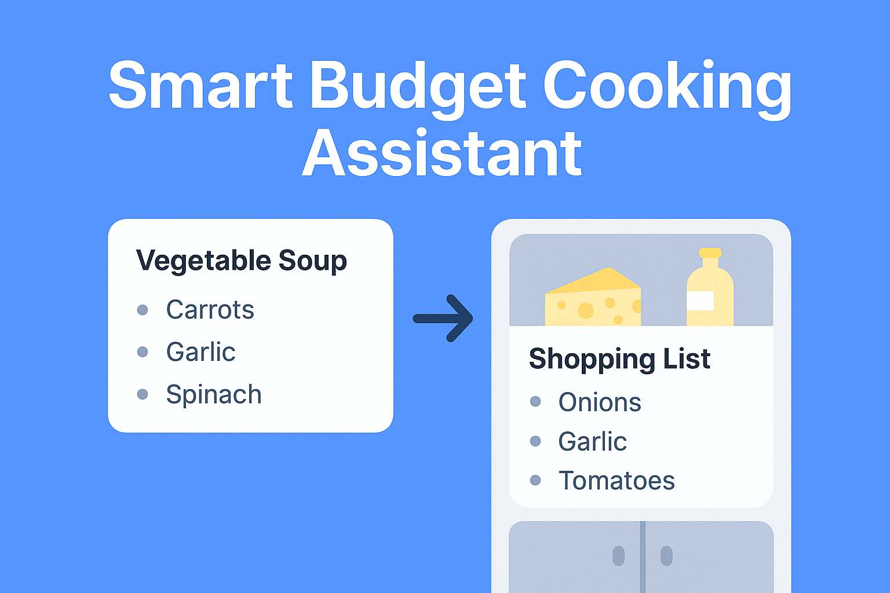

# 🍳 Smart Budget Cooking Assistant

Plan meals, control costs, and cook simply.  
Built with **React + Vite + Firebase + Tailwind CSS**, deployed on **Vercel**.




---

## ✨ Features

- 🔐 **User Authentication** — secure signup/login with Firebase Auth (Email/Password).
- 🍲 **Recipe Manager** — add, view, and delete recipes.
- 🛒 **Budget Tracking** — recipes include estimated costs, total shown in dashboard.
- 📋 **Ingredients & Steps** — structured input with simple chips and instructions.
- 🎨 **Apple-inspired UI** — clean, responsive design with Tailwind CSS.
- ☁️ **Deployed on Vercel** — continuous deployment from GitHub.

---

## 🛠️ Tech Stack

- **Frontend**: React 18 + Vite 5
- **Styling**: Tailwind CSS + custom Apple-style components
- **Auth & DB**: Firebase Authentication + Firestore
- **Hosting/CI**: Vercel (GitHub integration)

---

## 🚀 Live Demo
👉 [Smart Budget Cooking Assistant on Vercel](https://smart-budget-cooking-assistant.vercel.app)  
*(replace with your actual production URL)*

---


---

## ⚙️ Setup (Local Development)

1. **Clone the repo**
   ```bash
   git clone https://github.com/gerardjosraudale/smart-budget-cooking-assistant.git
   cd smart-budget-cooking-assistant

2. **Install dependencies
npm install

3. Add environment variables
Create a .env.local file in the root:
VITE_FIREBASE_API_KEY=your_api_key
VITE_FIREBASE_AUTH_DOMAIN=your_project.firebaseapp.com
VITE_FIREBASE_PROJECT_ID=your_project_id
VITE_FIREBASE_STORAGE_BUCKET=your_project.appspot.com
VITE_FIREBASE_SENDER_ID=your_sender_id
VITE_FIREBASE_APP_ID=your_app_id
These values are available in Firebase Console → Project Settings → SDK setup & configuration.

4. Run locally
npm run dev
Open http://localhost:5173.

5. Build for production
npm run build
npm run preview

📦 Deployment (Vercel)
Framework preset: Vite
Build command: npm run build
Output directory: dist
Environment variables: add all VITE_FIREBASE_* keys in Vercel → Settings → Environment Variables
Add your Vercel domain to Firebase → Authentication → Authorized domains
📚 Roadmap
 Profile setup (budget, dietary restrictions, cuisines)
 Shopping list generator
 Weekly budget summary card
 Group/Shared lists
 Offline support
👤 Author
Josue Raudales
LinkedIn · GitHub
📝 License

This project is open source and available under the MIT License.
